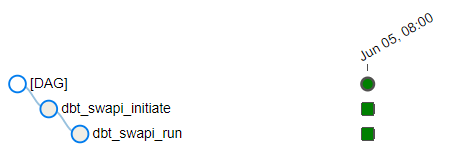

# castlery_submission

Submission for assignment on Castlery interview

## Tech Stacks
- Apache Airflow: for workflow orchestration
- DBT Core: for transforming data after data is inside BigQuery
- Pandas: for Data Manipulation
- Google Cloud Storage: for Data Lake Storage
- Google BigQuery: for Data Warehouse 
- BeautifulSoup: for Data Crawling
- Docker: for containerization
- Flask: for API endpoint

### Question 1 - SWAPI API


As shown from the image above, I used airflow to orchestrate the data pipeline.
I divided the data pipeline to three endpoints of the swapi API:
- people
- films
- planets

for each of the endpoints, the tasks are:
- download swapi dataset: this is to download the json data from the swapi api to local data
- convert swapi to parquet: this is to convert the json data downloaded from step 1 to a parquet file
- upload staging to gcs: this is to upload the parquet file from step to gcs as a staging dataset
- remove files from local: this is to delete all the parquet and json files that were downloaded in the first two steps
- staging create external table: this is to create a bigquery external table that points to the staging parquet that is uploaded in step 3
- staging create empty table: this is to create a bigquery empty table to load the data from the external table
- staging execute insert query: this is to insert data from external table to the empty table created in the previous step

After successfully executing the tasks above, it will create:
- Three folders in Google Cloud Storage: staging_films, staging_people, staging_planets. These three folders will store the staging parquets from each endpoint


- Six staging tables in the Big Query. The "staging_(endpoint)_external" tables are linked directly to each endpoint parquet in Google Cloud Storage. The other tables are loaded with the data from the external table with minimal data transformation, such as data type conversion.


The final step is to use DBT to transform the data in the BigQuery to the production tables



For the DBT steps:
- dbt swapi initiate: this is to install all the required packages and check the required schema in the DBT tools.
- dbt swapi run: this is to execute and create all the production tables that are configured in the DBT models.

After successfully running the two steps above, it will create three production tables:
- dim_films
- dim_people
- film_people_map


These three production tables above store all the information and schema as required by the assignment question.


### Question 2 - RottenTomatoes Web Crawling


Similar to question 1, I used similar steps as explained below:
- convert top movies to parquet: this is the web crawling steps to crawl all the required information from rotten tomatoes, transform the data to required format, strip all the blankspaces and incorrect format, and then convert it to a parquet in a local directory.
- upload fact top movies to gcs: this is to upload the generated parquet into Google Cloud Storage for staging purpose.
- remove top movies files from local: this is to remove the parquet file in the local directory.
- fact top movies create external table: this is to create a BigQuery external query that links to the top movies parquet in GCS from step 2
- fact top movies create empty table: this is to create an empty BigQuery table.
- fact top movies execute insert query: this is to insert all the top movies data to the empty table in the previous step.

As I have already did all the data cleaning in the step 1 mentioned above, I do not need to use DBT to further process the top movies dataset.

After executing the steps above, it will create the following tables and folders:
- one table in Google Cloud Storage for storing the top movies parquet


- two tables in BigQuery to store the top movies dataset


the table "fact_top_movies" store all the required columns and data required by the assignment question.


### Question 3 - Flask


The project for this question is under "/flask_postgresql/src/example" folder

app.py is the main script that has the API endpoint configuration.

To run the flask application, we need to first run the command: 

```cmd
docker-compose up --build
```

And then in a separate terminal, run the following command:
```cmd
virtualenv .venv
source .venv/bin/activate
pip install -r requirements.txt

# To load env variables
export $(xargs < database.conf)
export FLASK_APP=src/example/app.py
flask run

# Running on http://127.0.0.1:5000
```

Before tackling each of the API endpoint's in the question, I created another endpoint to import the data from the csv to the database:
```python:
@app.route('/employee/import_csv', methods=['GET'])
def import_csv():
    employees_df = pd.read_csv('./src/example/employees.csv')
    employees_df['id'] = employees_df['id'].astype('int64')
    employees_df['age'] = employees_df['age'].astype('int64')
    employees_df['salary'] = employees_df['salary'].astype('float')

    for index,data in employees_df.iterrows():
        employee = data['employee']
        gender = data['gender']
        age = data['age']
        salary = data['salary']
        town = data['town']
        database.add_instance(Employees, employee=employee, gender=gender, age=age, salary=salary, town=town)

    return json.dumps("csv imported"), 200
```

And after that, executing the GET request to import the CSV:


Below is the main part of the scripts where I configured each of the endpoint API's:
- GET /employee: obtains a json output for all existing employees in the database

```python:
@app.route('/employee', methods=['GET'])
def fetch():
    employees = database.get_all(Employees)
    all_employees = []
    for employee in employees:
        new_employee = {
            "id": employee.id,
            "employee": employee.employee,
            "gender": employee.gender,
            "age": employee.age,
            "salary": employee.salary,
            "town": employee.town,
        }

        all_employees.append(new_employee)
    return json.dumps(all_employees), 200
```
Below is the result after executing the GET request:


- GET /employee/id: obtain a json output of an existing employee from the database

```python:
@app.route('/employee/<employee_id>', methods=['GET'])
def fetch_single(employee_id):
    employee = database.get_instance(Employees,employee_id)
    new_employee = {
        "id": employee.id,
        "employee": employee.employee,
        "gender": employee.gender,
        "age": employee.age,
        "salary": employee.salary,
        "town": employee.town,
    }
    return json.dumps(new_employee), 200
```

Below is the result after executing the GET request:


- POST /employee: Add a new employee to the database


```python:
@app.route('/employee', methods=['POST'])
def add():
    data = request.get_json()
    employee = data['employee']
    gender = data['gender']
    age = data['age']
    salary = data['salary']
    town = data['town']

    database.add_instance(Employees, employee=employee, gender=gender, age=age, salary=salary, town=town)
    return json.dumps("Added"), 200
```

Below is the result after executing the POST request:


- POST /employee/id: Update an existing employee in the database (id should not be
updatable)


```python:
@app.route('/employee/<employee_id>', methods=['POST'])
def edit(employee_id):
    data = request.get_json()
    new_employee = data['employee']
    new_gender = data['gender']
    new_age = data['age']
    new_salary = data['salary']
    new_town = data['town']
    database.edit_instance(Employees, id=employee_id, employee=new_employee, gender=new_gender, age=new_age, salary=new_salary, town=new_town)
    return json.dumps("Edited"), 200
```

Below is the result after executing the POST request:


- DELETE /employee/id: delete an existing employee from the database
```python:
@app.route('/employee/<employee_id>', methods=['DELETE'])
def remove(employee_id):
    database.delete_instance(Employees, id=employee_id)
    return json.dumps("Deleted"), 200
```

Below is the result after executing the DELETE request:


